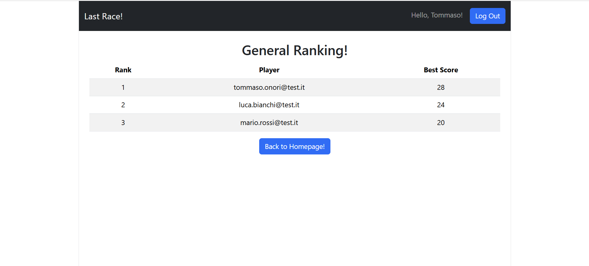
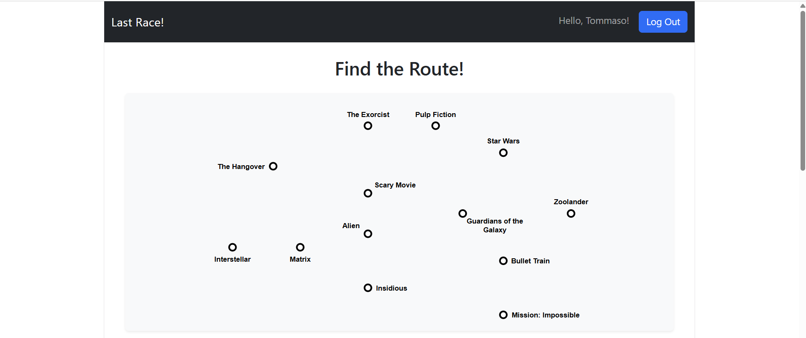
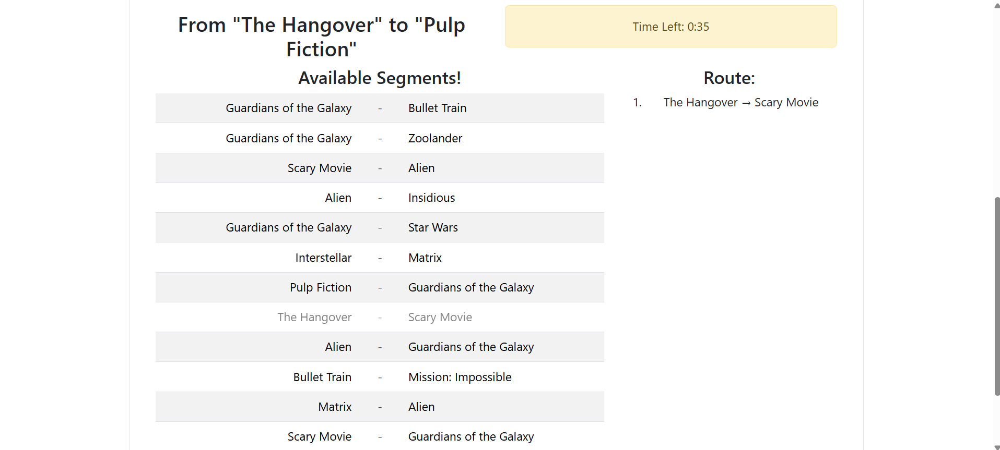

# Exam #1: "Last Race"
## Student: s354269 ONORI TOMMASO

## React Client Application Routes

- Route `/` : Instructions Page - Containes the Game Rules
- Route `/login` : Login Page - Contains the Login Form
- Route `/game` : Game Page - Shows the Network, Segments and eventually Results
- Route `/scores` : Ranking Page - Showing the Global Ranking
- Route `*` : Fallback Page - Not Found Page

## API Server

### Authentication API

GET `/api/sessions/current`
  ```json
  req: {
    method: "GET"
  }
  ```
  ```json
  res(200 OK): {
    id: "_id",
    name: "mock_name",
    surname: "mock_surname",
    username: "mock_username",
    email: "mock_email",
    bestScore: "mock_score"
  }

  res(401 Unauthorized): {
    error: "No active session."
  }
  ```

POST `/api/sessions`
  ```json
  req: {
    method: "POST",
    headers: {
      "content-type": "application/json"
    },
    body: {
      "username": "mock_username",
      "password": "mock_password"
    }
  }
  ```
  ```json
  res(200 OK): {
    id: "_id",
    name: "mock_name",
    surname: "mock_surname",
    username: "mock_username",
    email: "mock_email",
    bestScore: "mock_score"
  }

  res(401 Unauthorized): {
    error: "Invalid credentials."
  }
  ```

DELETE `/api/sessions/current`
  ```json
  req: {
      method: "DELETE"
    }
  ```
  ```json
  res(200 OK): {}
  ```
---
### Game API

GET `/api/network`
  ```json
  req: {
    method: "GET"
  }
  ```
  ```json
  res(200 OK): {
    network: {
        stations: [{
            SID: _SID,
            Name: _Name
        }, ...],

        lines: [{
            LID: _LID,
            Name: _Name
        }, ...],

        segments: [{
            from: currentStop.SID,
            to: nextStop.SID,
            lineId: currentStop.LID
        }, ...],
    }
  }

  res(500 Server Error): {
    error: "Network retrieval error."
  }
  ```

GET `/api/game/setup`
  ```json
  req: {
    method: "GET"
  }
  ```
  ```json
  res(200 OK): {
    endpoints: [
      startStation,
      endStation
    ]
  }

  res(500 Server Error): {
    error: "Endpoints retrieval error."
  }
  ```

POST `/api/games`
```json
  req: {
    method: "POST",
    headers: {
      "content-type": "application/json"
    },
    body: {
      route: _selectedRoute,
      endpoints: _endpoints
    }
  }
  ```
  ```json
  res(200 OK): {
    valid: true,
    events: [
      {
        name: _Name,
        description: _Description,
        value: _value
      }, ...
    ],
    finalScore: _score
  }

  res(200 OK): {
    valid: false,
    finalScore: 0
  }

  res(500 Server Error): {
    error: "Events retrieval error."
  }
  ```

GET `/api/ranking`
  ```json
  req: {
    method: "GET",
  }
  ```
  ```json
  res(200 OK): {
    ranking: [
      {
        Rank: _rank,
        Email: _email,
        MaxScore: _score
      }, ...
    ]
  }

  res(500 Server Error): {
    error: "Ranking retrieval error."
  }
  ```

## Database Tables

- Table `Stations(SID, Name)`
- Table `Lines(LID, Name)`
- Table `Stops(LID, SID, StopNumber)`
- Table `Events(EID, Name, Description, Value)`
- Table `Player(PID, Name, Surname, BestScore, Email, HashedPassword, Salt)`
- Table `Games(GID, PID, Score, Date)`

## Main React Components

`MyNavbar`
  - Purpose: Handling navigation to different pages.
  - Functionality: Displays the "Last Race" title and a "Log In" button.

`LoginPage`
  - Purpose: Allowing access to protected routes.
  - Functionality: Displays the game rules and dynamically renders a login button for anonymous users, or links to start a game and view the leaderboard for authenticated players.

`InstructionsPage`:
  - Purpose: Provides game's rule to any type of user.
  - Functionality: Displays the game rules and a button to sign in if unauthenticated, or to start a game and view rank if authenticated

`GamePage`:
  - Purpose: Hosts the core gameplay and manages the internal state for the different phases of a match.
  - Functionality: <br> Allows authenticated users to:
    1. View the metro network map (`SetupPhasePage`).
    2. Plan a route between two assigned stations within a 90-second timer and submit the route for validation (`PlanningPhasePage`).
    3. See the execution of the journey with unexpected events (`ExecutionPhasePage`)
    4. View the final score (`ResultsPhasePage`).

`RankingPage`:
  - Purpose: Displays the general leaderboard of the application.
  - Functionality: Retrieves from the server and shows a ranking table containing the best score achieved by each registered player

## Screenshot

### Ranking Page


### Game Page




## Users Credentials

User "Mario Rossi":
```json
{ username: "mario.rossi@test.it", password: "Password1!" }
```

User "Luca Bianchi":
```json
{ username: "luca.bianchi@test.it", password: "Password2!" }
```

User "Tommaso Onori":
```json
{ username: "tommaso.onori@test.it", password: "Password3!" }
```

## Use of AI Tools
During the development of this project, I utilized AI tools for CSS styling across the entire application, ensuring a coherent design. Additionally, inside the `InstructionPage` component, the regulation text has been generated and styled using AI.
On the database side, I used AI as technical reference to help me construct the queries, especially with the `RANK()` operator.